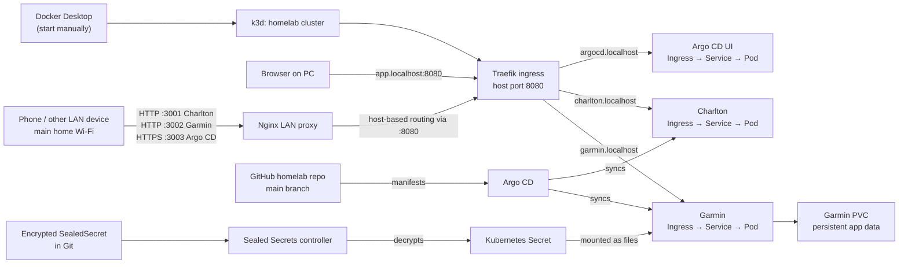

# Homelab cluster runbook

This repository manages workloads on the existing local Kubernetes cluster. The cluster runs in **k3d** using Docker Desktop; Argo CD watches this repository's `main` branch and reconciles the applications.

## How it fits together


## Start the cluster after a Windows restart

Docker Desktop is configured not to start with Windows, so start it manually first:

1. Open **Docker Desktop** from the Start menu and wait until it reports that the engine is running.
2. Open PowerShell and run:

   ```powershell
   cd C:\Users\matth\Documents\homelab
   k3d cluster start homelab
   kubectl config use-context k3d-homelab
   ```

   The k3d node containers use Docker's `unless-stopped` restart policy, so they may already have started when Docker Desktop became ready. `k3d cluster start homelab` ensures the existing cluster is started; it does not create a new one.

3. Check that the nodes, workloads, and Argo CD applications are healthy:

   ```powershell
   kubectl get nodes
   kubectl get pods -A
   kubectl get applications.argoproj.io -n argocd
   ```

   Nodes should show `Ready`; application pods should show `Running` and `1/1`; Argo CD applications should show `Synced` and `Healthy`.

## Open the apps

The k3d load balancer publishes Traefik ingress on host port `8080`:

- Charlton: <http://charlton.localhost:8080>
- Garmin: <http://garmin.localhost:8080>

## Access from a phone or other device on your home LAN

You can open the apps from a phone, tablet, or another computer without setting up local DNS. Connect the device to your **main home Wi-Fi/LAN** (not an isolated guest network), then enter the PC's static LAN IP and the app's port in the browser:

- Charlton: <http://192.168.1.109:3001>
- Garmin: <http://192.168.1.109:3002>
- Argo CD: <https://192.168.1.109:3003> (self-signed certificate; see Argo CD section below)

The small Nginx proxy listens on those ports and forwards each request to the existing Traefik ingress with the hostname that app expects. Before using the links, Docker Desktop must be running and the `homelab` k3d cluster must be up. Start the proxy once from the repository root if it is not already running:

```powershell
docker compose -f .\compose.lan.yml up -d
```

The proxy uses Docker's `unless-stopped` restart policy, so it starts again when Docker Desktop starts. If a link times out, check that the proxy container is running with `docker ps --filter name=homelab-lan-proxy`. If Windows Firewall is blocking the connection, add this inbound rule in an Administrator PowerShell:

```powershell
New-NetFirewallRule -DisplayName "Homelab LAN sites" -Direction Inbound -Action Allow -Protocol TCP -LocalPort "3001-3003" -RemoteAddress "192.168.1.0/24" -Profile Public
```

Charlton and Garmin use HTTP; Argo CD uses HTTPS with the local self-signed certificate. Do not create a router port-forward for these ports. If the PC's static IP changes, update the address in `compose.lan.yml`, the upstream addresses in `lan-proxy/nginx.conf`, the certificate SAN, and the links above.

To stop the LAN proxy:

```powershell
docker compose -f .\compose.lan.yml down
```
## Argo CD

Argo CD is available from the PC or another device on the home LAN at <https://192.168.1.109:3003>. This route uses the Nginx LAN proxy and Traefik ingress; it does not require a terminal port-forward, local DNS, or a router port-forward. The TLS certificate is self-signed, so browsers will show a certificate warning unless you install the certificate as trusted on the device.

The Argo CD route is configured by `argocd/ui-access.yaml`. Apply it once (and again after changing it):

```powershell
kubectl apply -f .\argocd\ui-access.yaml
kubectl rollout restart deployment/argocd-server -n argocd
kubectl rollout status deployment/argocd-server -n argocd
```

The Nginx proxy needs a local certificate and key. They are ignored by Git. Regenerate them if the local `lan-proxy\certs` directory is missing:

```powershell
New-Item -ItemType Directory -Force .\lan-proxy\certs | Out-Null
& 'C:\Program Files\Git\usr\bin\openssl.exe' req -x509 -nodes -days 825 -newkey rsa:2048 `
  -keyout .\lan-proxy\certs\argocd.key `
  -out .\lan-proxy\certs\argocd.crt `
  -subj '/CN=192.168.1.109' `
  -addext 'subjectAltName=IP:192.168.1.109,DNS:argocd.localhost'
```

Start or refresh the proxy from the repository root:

```powershell
docker compose -f .\compose.lan.yml up -d
```

Argo CD's server runs in insecure HTTP mode behind the LAN proxy, which terminates TLS. The app-to-cluster path stays on the private LAN. Do not expose port `3003` through your router.
Useful status and troubleshooting commands:

```powershell
kubectl get applications.argoproj.io -n argocd
kubectl describe application garmin -n argocd
kubectl describe application charlton -n argocd
kubectl get pods -A
kubectl logs -n garmin deployment/garmin -c web --since=1h
```

## Deploy changes

The Argo CD applications track `main` and have automated sync enabled. For changes to an existing app, commit and push the manifests to GitHub; Argo CD will fetch and apply them.

To register an app with Argo CD for the first time, apply its Application manifest once. For example:

```powershell
kubectl apply -f .\argocd\garmin.yaml
```

The Application manifest points Argo CD at `apps/garmin`. The `apps/<name>/kustomization.yaml` file lists the Kubernetes resources for that app.

`apps/garmin/sealed-secret.yaml` contains encrypted SealedSecret data and is intentionally allowed through the `.gitignore` rule. Commit only this encrypted manifest, never plaintext credentials. The Sealed Secrets controller creates the regular `garmin-secrets` Secret inside the cluster.

## Stop the cluster

To stop the k3d cluster while preserving it for the next start:

```powershell
k3d cluster stop homelab
```

This stops the cluster containers but keeps the cluster and its persistent volumes. Do not use `k3d cluster delete homelab` unless you intend to remove the cluster and its stored data. You can then close Docker Desktop if you want to stop the Docker engine too.

## Current setup and limits

- Cluster name: `homelab`; kubectl context: `k3d-homelab`.
- One k3s server and one agent, managed by Docker Desktop.
- Traefik handles the local app ingresses on port `8080`.
- Argo CD and Sealed Secrets run in the cluster; application definitions are under `argocd/`.
- `setup-homelab.ps1` creates repository/app scaffolding. It does **not** create the k3d cluster or install Argo CD.
- This runbook covers starting and stopping the existing cluster. A clean rebuild needs the original k3d creation settings, Argo CD installation steps, and a backup of the Sealed Secrets controller key; those are not currently captured in this repository.

### Garmin sync note

The Garmin pod can be healthy while showing fallback data if Garmin returns HTTP `429 Too Many Requests`. The current app performs a fresh Garmin login on each background poll and manual refresh. Avoid repeated refreshes while rate-limited; persistent Garmin token reuse still needs to be implemented.
